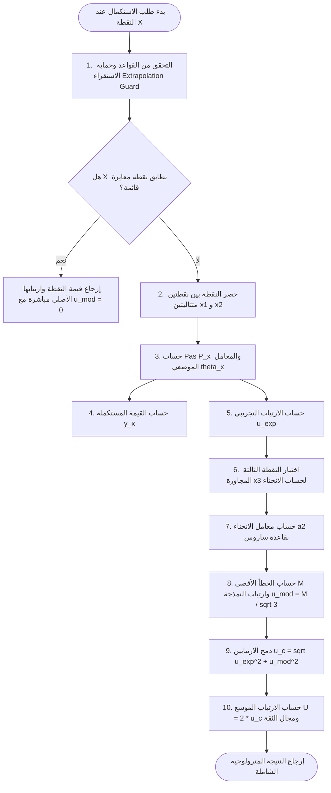
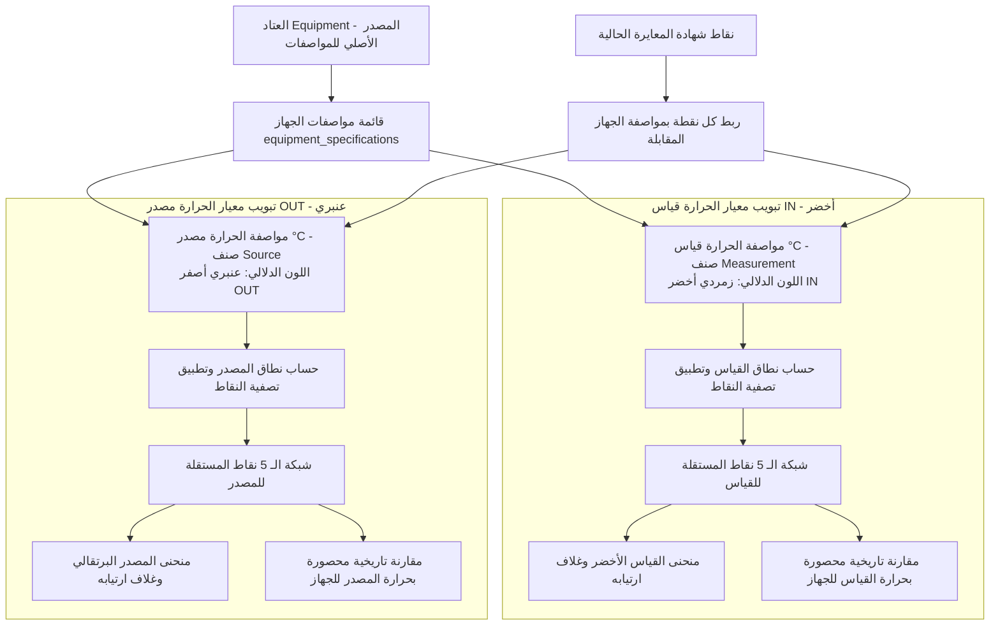
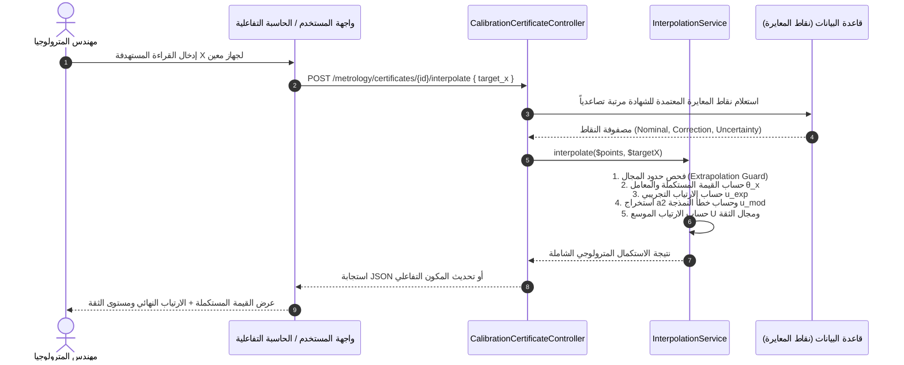

# دليل المعمارية الهندسية للاستكمال الخطي وارتياب القياس ومنطق الاستدعاء
# Linear Interpolation & Uncertainty Architecture & Invocation Guide (Florian Platel Model)

**النظام:** منصة ENGI-MATE / ERP-GMTM للمترولوجيا الصناعية وإدارة الأجهزة  
**المجال:** وحدة المترولوجيا والمعايرة الفنية (`Metrology & Calibration Domain`)  
**المرجع العلمي:** نموذج فلوريان بلاتي (Florian Platel Model - CFM / Collège Français de Métrologie)  
**تاريخ التوثيق:** 2026-09-23  
**الحالة:** معتمد ومرجعي (Authoritative Technical Specification)

---

## 1. المنظور والنمذجة المترولوجية (Metrological Modeling)

> [!IMPORTANT]
> **القاعدة المترولوجية المعتمدة في النظام:**  
> عند استكمال قراءة قياس $x$ واقعة بين نقطتي معايرة متتاليتين $(x_1, y_1)$ و $(x_2, y_2)$، لا يقتصر الاستكمال الخطي على حساب القيمة التقديرية $y(x)$ فقط، بل يتطلب تقييماً دقيقاً وصارماً للارتياب المصاحب $u(y(x))$ عبر **الفصل الصارم بين مصدرين مستقلين للشك**:
> 1. **الارتياب التجريبي ($u_{exp}$):** ناتج عن ارتياب شهادة المعايرة لجهاز المعيار، وتكرارية ودقة قراءات جهاز الفحص عند نقاط المعايرة المعتمدة.
> 2. **خطأ النمذجة الهندسي المنهجي ($u_{mod}$):** ناتج عن استبدال منحنى سلوك الجهاز الحقيقي (الذي غالباً ما يكون غير خطي) بقطعة مستقيمة بين نقطتي المعايرة.

```mermaid
graph TD
    A[الارتياب الكلي للاستكمال الخطي Uc] --> B[1. الارتياب التجريبي u_exp<br>Experimental Uncertainty]
    A --> C[2. خطأ النمذجة الهندسي u_mod<br>Geometric Modeling Error]
    
    B --> B1[المصدر: ارتياب نقاط المعايرة u_y1 و u_y2 من الشهادة]
    B --> B2[النموذج: قانون انتشار التباينات GUM مع معامل الموضع θ_x]
    B --> B3[الحالات: نقاط مستقلة r=0 أو مترابطة r=1]
    
    C --> C1[المصدر: انحناء الدالة الفيزيائية الحقيقية f_x]
    C --> C2[النموذج: تقريب لاغرانج وكثير حدود الدرجة الثانية p_x عبر نقطة ثالثة x3]
    C --> C3[الاشتقاق: محدد فانديرموند وقاعدة ساروس لحساب المعامل a2]
    C --> C4[الحد الأقصى للخطأ: M = P_x^2 / 4 * |a2| بتوزيع مستطيل]
```

---

## 2. الاشتقاق الرياضي والمترولوجي (Mathematical Derivations)

### 2.1 معادلة الاستكمال الخطي ومعامل الموضع ($\theta_x$)
ليكن مجال القياس محصوراً بين نقطتين متتاليتين: $x_1 \le x \le x_2$.  
طول خطوة المعايرة (Pas d'étalonnage):
$$P_x = x_2 - x_1$$

يُعرّف **المعامل الموضعي النسبي ($\theta_x$)** داخل المجال بالصيغة:
$$\theta_x = \frac{x - x_1}{x_2 - x_1} = \frac{x - x_1}{P_x} \quad \text{حيث} \quad 0 \le \theta_x \le 1$$

وتكون القيمة المستكملة خطياً $y(x)$ (سواء كانت قيمة التصحيح $C$ أو القراءة المعايرة):
$$y(x) = (1 - \theta_x) y_1 + \theta_x y_2$$

---

### 2.2 تطبيق قانون انتشار التباينات لحساب الارتياب التجريبي ($u_{exp}$)
وفق دليل التعبير عن ارتياب القياس (GUM - ISO/IEC Guide 98-3)، بتطبيق قانون انتشار التباينات على الدالة $y(x) = f(y_1, y_2)$:
$$u_{exp}^2(x) = \left(\frac{\partial y}{\partial y_1}\right)^2 u^2(y_1) + \left(\frac{\partial y}{\partial y_2}\right)^2 u^2(y_2) + 2 \left(\frac{\partial y}{\partial y_1}\right) \left(\frac{\partial y}{\partial y_2}\right) u(y_1, y_2)$$

حيث المعاملات الجزئية:
$$\frac{\partial y}{\partial y_1} = 1 - \theta_x, \quad \frac{\partial y}{\partial y_2} = \theta_x$$

#### أ. حالة النقاط المستقلة غير المترابطة ($r = 0$):
$$u_{exp}^2(x) = (1 - \theta_x)^2 u^2(y_1) + \theta_x^2 u^2(y_2)$$

> [!TIP]
> **الخاصية الرياضية للمتباينة:**  
> بما أن $\theta_x \in [0, 1]$، فإن المقدار $(1 - \theta_x)^2 + \theta_x^2$ يحقق دوماً:
> $$\frac{1}{2} \le (1 - \theta_x)^2 + \theta_x^2 \le 1$$
> حيث تبلغ القيمة دنياها ($\frac{1}{2}$) عند المنتصف تماماً ($\theta_x = 0.5$)، وأقصاها ($1$) عند الحواف ($\theta_x = 0$ أو $\theta_x = 1$).  
> هذا يضمن رياضياً أن الارتياب التجريبي المستكمل داخل المجال لا يتجاوز أبداً القيمة العظمى للارتياب عند الأطراف:
> $$u_{exp}(x) \le \max\left(u(y_1), u(y_2)\right)$$

#### ب. حالة النقاط المترابطة بالكامل ($r = 1$ - وهو الغالب في نفس شهادة المعايرة):
عند إجراء المعايرة بنفس وسيلة العيار والظروف البيئية، يكون الارتباط موجباً وقوياً ($r \approx 1$):
$$u_{exp}(x) = (1 - \theta_x) u(y_1) + \theta_x u(y_2)$$
ويمثل هذا حداً أعلى محافظاً (Conservative Upper Bound) ومضموناً للارتياب التجريبي.

---

### 2.3 تقييم خطأ انحناء الدالة ($a_2$) ونمذجة بلاتي (Florian Platel)

#### أ. صيغة لاغرانج والتقريب المحلي بكثير حدود من الدرجة الثانية
إذا كانت الدالة الفيزيائية الحقيقية للسلوك $f(x)$ ذات انحناء، فإن الخطأ الناتج عن الاستكمال الخطي بقطعة مستقيمة يُقدّر بصيغة لاغرانج للخطأ:
$$e(x) = f(x) - y(x) = \frac{(x - x_1)(x - x_2)}{2} f''(\xi), \quad \xi \in [x_1, x_2]$$

لتقدير المشتقة الثانية محلياً دون الحاجة لمعرفة الدالة الفيزيائية مسبقاً، يعتمد نموذج **فلوريان بلاتي** على تقريب الدالة محلياً بكثير حدود من الدرجة الثانية:
$$p(x) = a_0 + a_1 x + a_2 x^2$$
حيث تكون المشتقة الثانية ثابتة وتساوي:
$$p''(x) = 2 a_2$$

#### ب. اشتقاق معامل الانحناء ($a_2$) بمحدد فانديرموند وقاعدة ساروس
لتحديد $a_2$ بدقة، يتم اختيار **نقطة معايرة ثالثة مجاورة** $(x_3, y_3)$ من جدول المعايرة (تكون $x_3 > x_2$ إن وجدت، أو $x_3 < x_1$ عند الطرف العلوي).  
بالتعويض في النقاط الثلاث المتمايزة $(x_1, y_1), (x_2, y_2), (x_3, y_3)$ نحصل على جملة المعادلات:
$$\begin{pmatrix} 1 & x_1 & x_1^2 \\ 1 & x_2 & x_2^2 \\ 1 & x_3 & x_3^2 \end{pmatrix} \begin{pmatrix} a_0 \\ a_1 \\ a_2 \end{pmatrix} = \begin{pmatrix} y_1 \\ y_2 \\ y_3 \end{pmatrix}$$

محدد المصفوفة هو **محدد فانديرموند (Vandermonde Determinant)**:
$$\Delta = (x_2 - x_1)(x_3 - x_1)(x_3 - x_2)$$

وبتطبيق قاعدة كرامر وساروس لعزل المعامل $a_2$:
$$\Delta_{a_2} = \begin{vmatrix} 1 & x_1 & y_1 \\ 1 & x_2 & y_2 \\ 1 & x_3 & y_3 \end{vmatrix} = y_1(x_3 - x_2) - y_2(x_3 - x_1) + y_3(x_2 - x_1)$$

وبالتالي فإن معامل الانحناء يحسب مباشرة بالصيغة التحليلية:
$$a_2 = \frac{y_1(x_3 - x_2) - y_2(x_3 - x_1) + y_3(x_2 - x_1)}{(x_2 - x_1)(x_3 - x_1)(x_3 - x_2)} = \frac{\frac{y_3 - y_2}{x_3 - x_2} - \frac{y_2 - y_1}{x_2 - x_1}}{x_3 - x_1}$$
وهو يطابق بدقة **الفروق النسبية من الدرجة الثانية (Second-Order Divided Difference)**.

#### ج. حساب الحد الأقصى لخطأ النمذجة ($M$)
الحد الأقصى لخطأ الاستكمال الهندسي يقع في منتصف المجال عند $\theta_x = 0.5$ وقيمته:
$$M = \max_{x \in [x_1, x_2]} |e(x)| = \frac{(x_2 - x_1)^2}{8} |p''(\xi)| = \frac{P_x^2}{8} \cdot 2 |a_2| = \frac{P_x^2}{4} |a_2|$$

#### د. تحويل الخطأ إلى ارتياب قياسي ($u_{mod}$)
باعتبار خطأ النمذجة متغيراً يتبع **توزيعاً مستطيلاً (Rectangular / Uniform Distribution)** ضمن المجال $[-M, +M]$:
$$u_{mod}(x) = \frac{M}{\sqrt{3}} = \frac{P_x^2 |a_2|}{4 \sqrt{3}}$$

---

### 2.4 الارتياب المركب والارتياب الموسع النهائي ($U$)
يُحسب الارتياب القياسي المركب $u_c(x)$ بدمج الارتياب التجريبي وارتياب النمذجة الهندسي:
$$u_c(x) = \sqrt{u_{exp}^2(x) + u_{mod}^2(x)}$$

ويُحسب **الارتياب الموسع النهائي (Expanded Uncertainty)** بمعامل تغطية $k = 2$ (الموافق لمستوى ثقة $95.45\%$):
$$U(x) = k \cdot u_c(x) = 2 \cdot \sqrt{u_{exp}^2(x) + u_{mod}^2(x)}$$

مجال الثقة المترولوجي النهائي للقيمة المستكملة:
$$Y_{interp} = y(x) \pm U(x)$$

---

## 3. معمارية خدمة الاستكمال في التطبيق (`InterpolationService`)

### 3.1 بطاقة تعريف الخدمة
- **الصنف (Class):** `App\Services\InterpolationService`
- **الموقع:** [`app/Services/InterpolationService.php`](file:///c:/Project%20HARD/erp.gmtm-dz.com/app/Services/InterpolationService.php)
- **الكائن المرجوع (DTO):** `App\DTOs\InterpolationResult` أو مصفوفة بيانات ذات شكل محدد (`Array Shape`).

### 3.2 العقد البرمجي للخدمة (Service Contract Interface)
```php
namespace App\Services;

class InterpolationService
{
    /**
     * حساب القيمة المستكملة والارتياب المصاحب وفق نموذج بلاتي (Florian Platel).
     *
     * @param  array<int, array{nominal: float, value: float, uncertainty: float}>  $calibrationPoints
     * @param  float  $targetX
     * @param  bool  $correlated  الافتراضي true لربط نقاط نفس الشهادة (r = 1)
     * @return array{
     *     target_x: float,
     *     interpolated_value: float,
     *     theta: float,
     *     step_p: float,
     *     curvature_a2: float,
     *     max_modeling_error: float,
     *     u_exp: float,
     *     u_mod: float,
     *     u_combined: float,
     *     expanded_uncertainty: float,
     *     confidence_interval: array{lower: float, upper: float}
     * }
     */
    public function interpolate(array $calibrationPoints, float $targetX, bool $correlated = true): array;
}
```

---

## 4. الخوارزمية البرمجية خطوة بخطوة (Algorithm Implementation Steps)



### 4.1 حماية الاستقراء الخارجي (Extrapolation Guard)
- **القاعدة الصارمة:** يُحظر الاستقراء الخارجي للمترولوجيا ($x < x_{min}$ أو $x > x_{max}$) منعاً لحدوث أخطاء كارثية غير خطية.  
- إذا كانت $x$ خارج نطاق النقاط المسجلة، ترمي الخدمة استثناءً صريحاً:
  ```php
  if ($targetX < $minX || $targetX > $maxX) {
      throw new \InvalidArgumentException(__('Target value is outside calibrated range. Extrapolation is strictly forbidden.'));
  }
  ```

### 4.2 استراتيجية اختيار النقطة الثالثة المجاورة ($x_3$)
لحساب معامل الانحناء $a_2$، تلزم ثلاثة نقاط متتالية:
1. **في وسط جدول المعايرة:** نختار النقطة التالية لـ $x_2$ إن أمكن ($x_3 = x_{i+2}$).
2. **عند الحافة العلوية لجدول المعايرة (آخر مجال):** نختار النقطة السابقة لـ $x_1$ كمرجع انحناء ($x_3 = x_{i-1}$).
3. **في حال احتوى جدول المعايرة على نقطتين فقط:** يُعتبر السلوك خطياً تماماً بينهما ($a_2 = 0$) ويكون خطأ النمذجة $u_{mod} = 0$.

---

## 5. نظام شبكة وجدول الـ 5 نقاط المعيارية المستكملة (Customizable 5-Point Calibration & Interpolation Grid)

### 5.1 الفكرة والهدف الهندسي (Core Concept & Operational Workflow)
في الممارسة الصناعية والمترولوجية المعتمدة بشركة GMTM، تتطلب وثائق الفحص الميداني وتقارير المطابقة تمثيل أداء الجهاز بدقة عبر **شبكة معيارية مكونة من 5 نقاط أساسية** مرتبة تصاعدياً من الأصغر إلى الأكبر ($X_1 < X_2 < X_3 < X_4 < X_5$).

يوفر هذا النظام لمهندس المترولوجيا:
1. **التحكم الكامل في تحديد النقاط الخمس:**
   - **الوضع التلقائي (Automatic Distribution):** توليد 5 نقاط موزعة بانتظام على كامل نطاق المعايرة المعتمد (0%، 25%، 50%، 75%، 100%).
   - **الوضع المخصص (Custom Engineer Points):** إمكانية إدخال وتعديل 5 قيم حرة يحددها المهندس بما يناسب ظروف تشغيل الجهاز الميدانية أو نقاط التدقيق الخاصة بالعميل.

#### 5.1.1 آليات تحديد القيم الصغرى والقصوى في الوضع التلقائي (Min & Max Bounds Determination)
> [!IMPORTANT]
> **كيف يحدد النظام القيمة الصغرى ($X_{min}$) والقصوى ($X_{max}$) تلقائياً؟**  
> يعتمد النظام استراتيجية مترولوجية هرمية لضمان الدقة وتفادي الاستقراء:
> 1. **المصدر الأساسي والأكثر أماناً مترولوجياً (حدود نقاط الشهادة الفعلية Calibrated Span):**
>    - تُستخرج $X_{min}$ و $X_{max}$ تلقائياً من واقع جدول نقاط الفحص المسجلة في شهادة المعايرة الحالية:
>      $$X_{min} = \min_{i} \{ x_i^{cert} \}, \quad X_{max} = \max_{i} \{ x_i^{cert} \}$$
>    - **التعليل المترولوجي الصارم:** قد يكون نطاق الجهاز الاسمي (مثلاً $0 \rightarrow 100\text{ bar}$)، ولكن المختبر عاير الجهاز فعلياً في مجال جزئي فقط ($10 \rightarrow 80\text{ bar}$). إن اعتماد حدود الشهادة الفعلية يضمن بنسبة 100% أن كامل النقاط الخمس تقع داخل النطاق المغطى بالقياس التجريبي، مما يمنع الوقوع في فخ الاستقراء الخارجي (Extrapolation Guard).
> 2. **المصدر المقارن (نطاق مواصفة العتاد Equipment Specification Range):**
>    - إذا طابقت نقاط الشهادة كامل النطاق الاسمي للجهاز (`range_min` و `range_max` في جدول `equipment_specifications`)، فإن:
>      $$X_{min} = range\_min, \quad X_{max} = range\_max$$
> 3. **معادلة التقسيم الخماسي المتساوي (Uniform 5-Step Formula):**
>    - بمجرد تحديد $X_{min}$ و $X_{max}$، يحسب النظام خطوة التقسيم الموحدة:
>      $$\Delta X = \frac{X_{max} - X_{min}}{4}$$
>    - وتكون النقاط الخمس المعيارية الناتجة هي:
>      - $X_1 = X_{min}$ (تمثل $0\%$ من نطاق المعايرة)
>      - $X_2 = X_{min} + \Delta X = X_{min} + 0.25 \times (X_{max} - X_{min})$ (تمثل $25\%$)
>      - $X_3 = X_{min} + 2 \Delta X = X_{min} + 0.50 \times (X_{max} - X_{min})$ (تمثل $50\%$ - منتصف المجال)
>      - $X_4 = X_{min} + 3 \Delta X = X_{min} + 0.75 \times (X_{max} - X_{min})$ (تمثل $75\%$)
>      - $X_5 = X_{max}$ (تمثل $100\%$ من نطاق المعايرة)
> 4. **التحكم التفاعلي بالواجهة للمهندس (Interactive Range Overrides):**
>    - تعرض الواجهة حقلين للمهندس: حقل الحد الأدنى ($X_{min}$) وحقل الحد الأقصى ($X_{max}$) معبأين تلقائياً بالقيم المحسوبة من الشهادة.
>    - يمكن للمهندس تعديل حدي النطاق (ضمن مجال الشهادة)، وعند الضغط على زر **"توليد النقاط الـ 5 بانتظام" (Auto 5-Steps)** يُعاد حساب وتعبئة النقاط الخمس وفق المعادلة أعلاه فورياً.

2. **المعالجة الآلية عبر محرك الاستكمال المترولوجي (`Interpolation Engine`):**
   - لكل نقطة من النقاط الخمس $X_k \in \{X_1, X_2, X_3, X_4, X_5\}$:
     - **إذا كانت النقطة تطابق نقطة معايرة فعلية مسجلة في الشهادة ($X_k = x_i$):** تؤخذ القيمة المقاسة والارتياب الأصلي مباشرة من الشهادة، وتكون قيمة ارتياب النمذجة مساوية للصفر ($u_{mod} = 0$).
     - **إذا كانت النقطة تقع بين نقطتي معايرة ($x_i < X_k < x_{i+1}$):** يتدخل نموذج **فلوريان بلاتي (Florian Platel)** آلياً لحساب القيمة المستكملة $y(X_k)$، والارتياب التجريبي $u_{exp}$، ومعامل الانحناء $a_2$ عبر نقطة ثالثة مجاورة، ثم اشتقاق ارتياب النمذجة $u_{mod} = \frac{P_x^2 |a_2|}{4\sqrt{3}}$، وحساب الارتياب الموسع النهائي $U(X_k)$ ومجال الثقة.

```mermaid
graph TD
    PointsInput[تحديد النقاط الـ 5 المستهدفة من الأصغر للأكبر<br>X1 < X2 < X3 < X4 < X5] --> LoopPoints[معالجة كل نقطة X_k في الخدمة]
    
    LoopPoints --> CheckMatch{هل X_k تطابق نقطة في الشهادة؟}
    
    CheckMatch -- نعم --> ExactVal[استخدام قيمة الشهادة الأصلية<br>y = y_exact, u_exp = u_exact, u_mod = 0]
    CheckMatch -- لا --> PlatelEngine[تطبيق نموذج فلوريان بلاتي<br>1. حساب y_x بالاستكمال الخطي<br>2. حساب u_exp بقانون انتشار التباينات<br>3. حساب a2 عبر نقطة ثالثة<br>4. حساب u_mod = P_x^2 * |a2| / 4*sqrt 3]
    
    ExactVal --> CombinePoint[حساب الارتياب الموسع U = 2 * u_c]
    PlatelEngine --> CombinePoint
    
    CombinePoint --> TableOutput[جدول الـ 5 نقاط المعياري الشامل<br>مع شارات التمييز: مقاسة أصلية / مستكملة ببلاتي]
    CombinePoint --> CurveOutput[منحنى الـ 5 نقاط البياني المعياري<br>مع أشرطة الارتياب Error Bars: ± U]
```

---

### 5.2 التحديد الدقيق للوحدات والمعايير وفصل المعايير المتعددة (Precise Unit/Standard Identification & Multi-Parameter Isolation)

#### 5.2.1 المبدأ المترولوجي الحاكم: العتاد هو المرجع الأصلي للمعايير والوحدات
> [!IMPORTANT]
> **العتاد (`Equipment`) هو المصدر الأصلي والوحيد للمواصفات والوحدات:**  
> 1. تنبع جميع المعايير والوحدات الهندسية من **مواصفات الجهاز نفسه (`$equipment->specifications`)**، وليس من مجرد النقاط المسجلة في الشهادة. فالشهادة وثيقة تقييم ظرفية، بينما الجهاز هو الكيان الفيزيائي الحامل للمواصفات والحدود الاسمية.
> 2. **التمييز الصارم بين صنف القياس (`Measurement / IN`) وصنف المصدر (`Source / OUT`):**  
>    في الأجهزة متعددة الوظائف (كأجهزة المعايرة الميدانية ومحاكيات الإشارة)، قد يملك الجهاز الواحد معيارين يحملان نفس الوحدة واسم الكمية الفيزيائية، مثل:
>    - **الحرارة من صنف القياس (Temperature Measurement - Sensor / IN):** قراءة مستشعر أو مدخل مجس بوحدة `°C`.
>    - **الحرارة من صنف المصدر (Temperature Source - Generation / OUT):** توليد أو محاكاة إشارة حرارية بوحدة `°C`.
>    **يُحظر منعاً باتاً خلط أو دمج معيار قياس مع معيار مصدر لنفس الوحدة في شبكة استكمال واحدة أو مقارنة تاريخية مشتركة.**

#### 5.2.2 نظام التمييز اللوني والبصري الموحد للمعايير (Unified Semantic Color & Badge System)
يميز النظام كل معيار فيزيائي بلون وشارة دلالية موحدة تعتمد على صنف المعيار في العتاد (`Grandeur::type`):
1. **صنف القياس (`GrandeurType::Measurement` / Sensor / IN):**
   - **اللون الدلالي:** السمة الزمردية الخضراء (`success` / Emerald Green).
   - **الشارة والأيقونة:** شارة `[قياس / IN]` مع أيقونة الإدخال `<i class="fas fa-sign-in-alt"></i>`.
   - **المنحنى البياني ومحاوره:** يعتمد درجات الزمردي والأخضر في الخط وغلاف الارتياب ($\pm U$).
2. **صنف المصدر (`GrandeurType::Source` / Generation / OUT):**
   - **اللون الدلالي:** السمة العنبرية/البرتقالية التحذيرية (`warning` / Amber Yellow).
   - **الشارة والأيقونة:** شارة `[مصدر / OUT]` مع أيقونة التوليد والخرج `<i class="fas fa-bolt"></i>` أو `<i class="fas fa-sign-out-alt"></i>`.
   - **المنحنى البياني ومحاوره:** يعتمد درجات العنبري والبرتقالي الصناعي المعتمد لشركة GMTM.

#### 5.2.3 التحديد الصريح للمعايير والوحدات في كافة العناصر
1. **المصدر المترولوجي الموثوق:**
   - يُستخرج اسم المعيار من `Grandeur::name` (مثال: `Pression relative`, `Température`, `Courant DC`).
   - يُستخرج رمز المعيار ووحدته الهندسية من `Grandeur::symbol` (مثال: `bar`, `°C`, `mA`, `V`).
   - يُستخرج صنف المعيار من `Grandeur::type` (`measurement` أو `source`).
2. **إلزامية إبراز الوحدة والصنف في كامل المنظومة:**
   - **شريط التبويبات الفرعية لاختيار المعيار:** يعرض اسم المعيار، وحدته، نطاق الجهاز الاسمي، وشارة الصنف بلونها المميز:
     `[ Température (°C) [IN] ]` (زمردي) &nbsp;&nbsp; `[ Température (°C) [OUT] ]` (عنبري)
   - **جدول تفكيك الارتيابات:** يبرز الوحدة بجانب كل قيمة في الجدول: $X \text{ [Unit]}$, $Y \text{ [Unit]}$, $u_{exp} \text{ [Unit]}$, $u_{mod} \text{ [Unit]}$, $U \text{ [Unit]}$.
   - **محاور الرسم البياني (Chart Axes):**
     - محور السينات: $\text{Nominal Setpoint } X \text{ [Unit]}$
     - محور الصادات: $\text{Correction / Measured Value } Y \text{ [Unit]}$
   - **التلميحات البيانية (Tooltips):** عرض القيمة مصحوبة بوحدتها وصنف المعيار.

#### 5.2.4 معمارية الفصل والعزل التام في حال تعدد المعايير (Multi-Parameter Isolation Architecture)
1. **استقصاء المعايير من مواصفات الجهاز:**
   - يستعلم النظام عن كامل مواصفات العتاد المرتبط بالشهادة:
     `$certificate->equipment->specifications()->with('grandeur')->get()`
2. **عزل شبكة الـ 5 نقاط لكل معيار على حدى:**
   - لكل مواصفة حسابها الخاص لنطاق الفحص المستخرج من نقاط الشهادة المطابقة، مع الاستناد لنطاق الجهاز الاسمي `[range_min .. range_max]`.
   - تطبيق قاعدة **تجاهل أي نقاط تقع خارج مجال المعيار المحدد** بشكل مستقل تماماً.
   - لكل معيار شبكة 5 نقاط مستقلة خاصة به يتم تخزينها بربط مباشر مع `equipment_specification_id`.
3. **عزل المنحنى الفردي (Isolated Single Curve):**
   - رسم بياني مستقل للمعيار النشط ملوّن بحسب صنف المعيار (زمردي للقياس، عنبري للمصدر) يعرض منحنى التصحيح وغلاف الارتياب ($\pm U$).
4. **عزل منحنى المقارنة التاريخية للأجهزة (Isolated Historical Evolution Curve):**
   - حصر المقارنة حصراً بالشهادات السابقة لنفس الجهاز التي تعاير نفس المواصفة والصنف الفيزيائي (نفس `grandeur_id` ونفس `type`).



#### 5.2.5 تكييف قاعدة البيانات لدعم المعايير المتعددة (`calibration_interpolations`)
لتخزين شبكة الـ 5 نقاط لكل معيار في الشهادة دون تضارب، تتضمن بنية جدول `calibration_interpolations`:
- حقل `equipment_specification_id` (مفتاح خارجي Nullable يشير إلى المواصفة/المعيار):
  `$table->foreignId('equipment_specification_id')->nullable()->constrained('equipment_specifications')->nullOnDelete();`
- مركب الفهرسة:
  `$table->index(['calibration_certificate_id', 'equipment_specification_id', 'point_index']);`
- وبذلك يُتاح للشهادة الواحدة تخزين 5 نقاط لكل معيار مستقل تتم معايرته في الجهاز.

---

### 5.3 العقد البرمجي لتوليد شبكة الـ 5 نقاط (`generateFivePointGrid`)
يُضاف العقد التالي إلى `App\Services\InterpolationService`:

```php
/**
 * توليد جدول ومنحنى الـ 5 نقاط المعيارية المستكملة مع حساب ارتيابات بلاتي لكل نقطة.
 *
 * @param  array<int, array{nominal: float, value: float, uncertainty: float}>  $calibrationPoints
 * @param  array<int, float>  $fivePoints  مصفوفة من 5 قيم مرتبة تصاعدياً [X1, X2, X3, X4, X5]
 * @param  bool  $correlated  الافتراضي true لربط نقاط نفس الشهادة (r = 1)
 * @return array{
 *     points: list<array{
 *         point_index: int,
 *         target_x: float,
 *         interpolated_value: float,
 *         u_exp: float,
 *         curvature_a2: float,
 *         u_mod: float,
 *         u_combined: float,
 *         expanded_uncertainty: float,
 *         is_exact_point: bool,
 *         confidence_interval: array{lower: float, upper: float}
 *     }>,
 *     span_min: float,
 *     span_max: float,
 *     parameter_name: string,
 *     unit_symbol: string,
 *     equipment_specification_id: ?int,
 *     max_expanded_uncertainty: float
 * }
 */
public function generateFivePointGrid(array $calibrationPoints, array $fivePoints, bool $correlated = true, ?int $equipmentSpecificationId = null): array;
```

---

### 5.4 قواعد التحقق الصارمة للـ 5 نقاط (Strict 5-Point Validation Rules)
تفرض الخدمة شروطاً قطعية لضمان النزاهة الهندسية قبل إجراء أي حسابات:
1. **العدد الدقيق للنقاط:** يجب أن تحتوي مصفوفة الإدخال على 5 قيم تماماً (`count($fivePoints) === 5`).
2. **الترتيب التصاعدي الصارم:** يجب أن تكون النقاط مرتبة تصاعدياً بدقة دون أي تكرار:
   $$X_1 < X_2 < X_3 < X_4 < X_5$$
3. **حصر النطاق داخل حدود الشهادة (منع الاستقراء):**
   $$X_{min} \le X_1 \quad \text{و} \quad X_5 \le X_{max}$$
   إذا كانت أي نقطة أصغر من أول نقطة معايرة في الشهادة أو أكبر من آخر نقطة تابعة لنفس المعيار، يتم رفض الطلب فوراً باستثناء مترولوجي صريح.

---

### 5.5 بنية جدول العرض والتحكم في الواجهة (UI Table Specification)
يعرض جدول الـ 5 نقاط في الواجهة الأعمدة التالية متبوعة بالوحدة الهندسية الصريحة:
| رقم النقطة | النقطة المستهدفة ($X \text{ [Unit]}$) | القيمة المستكملة ($Y \text{ [Unit]}$) | الارتياب التجريبي ($u_{exp} \text{ [Unit]}$) | معامل الانحناء ($a_2$) | ارتياب النمذجة ($u_{mod} \text{ [Unit]}$) | الارتياب الموسع ($U, k=2 \text{ [Unit]}$) | مصدر النقطة المترولوجي |
| :---: | :---: | :---: | :---: | :---: | :---: | :---: | :---: |
| 1 | $X_1$ | $Y_1$ | $u_{exp,1}$ | $a_{2,1}$ | $u_{mod,1}$ | $\pm U_1$ | <x-badge variant="success">مقاسة أصلية</x-badge> |
| 2 | $X_2$ | $Y_2$ | $u_{exp,2}$ | $a_{2,2}$ | $u_{mod,2}$ | $\pm U_2$ | <x-badge variant="info">مستكملة (بلاتي)</x-badge> |
| 3 | $X_3$ | $Y_3$ | $u_{exp,3}$ | $a_{2,3}$ | $u_{mod,3}$ | $\pm U_3$ | <x-badge variant="info">مستكملة (بلاتي)</x-badge> |
| 4 | $X_4$ | $Y_4$ | $u_{exp,4}$ | $a_{2,4}$ | $u_{mod,4}$ | $\pm U_4$ | <x-badge variant="info">مستكملة (بلاتي)</x-badge> |
| 5 | $X_5$ | $Y_5$ | $u_{exp,5}$ | $a_{2,5}$ | $u_{mod,5}$ | $\pm U_5$ | <x-badge variant="success">مقاسة أصلية</x-badge> |

كما يُرفق الجدول بـ **رسم بياني للمنحنى المعياري** يربط النقاط الخمس بخط مستمر، ويعرض عند كل نقطة شريط عدم اليقين (Error Bar) بمجال الثقة $[Y_k - U_k, Y_k + U_k]$ مع تسمية المحاور بالوحدة الفيزيائية الصريحة.

---

## 6. مخطط تسلسل الاستدعاء التفاعلي (Sequence Diagram)



---

## 7. قواعد وضمانات النزاهة الهندسية (Engineering Integrity Standards)

1. **تفادي القسمة على الصفر:** فحص صارم للتأكد من أن $x_2 \neq x_1$ وأنه لا توجد نقاط مكررة بنفس القيمة الاسمية.
2. **عزل المنطق المترولوجي عن الواجهات:** تتم كافة العمليات الحسابية داخل `InterpolationService` دون أي كود HTML أو معالجة واجهات داخل الخدمة.
3. **التوثيق الثلاثي اللغات:** جميع رسائل الخطأ والاستثناءات تصدر بمفاتيح إنجليزية وتترجم في قواميس النظام (`en.json`, `ar.json`, `fr.json`).
4. **التغطية بالاختبارات المؤتمتة:** يجب تغطية الخدمة باختبارات فحص شاملة تتحقق من:
   - مطابقة التطابق التام ($x = x_i$).
   - القيمة عند منتصف المجال ($\theta_x = 0.5$).
   - منع الاستقراء خارج المجال ($x < x_{min}$ أو $x > x_{max}$).
   - صحة استخراج معامل الانحناء $a_2$ ومطابقته للحل اليدوي بمحدد فانديرموند.
